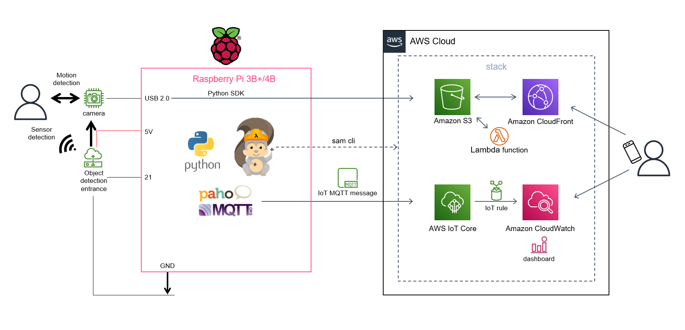
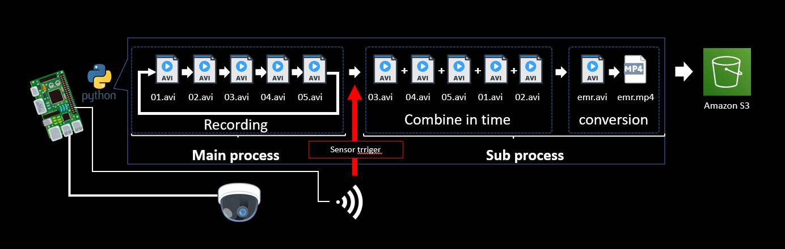
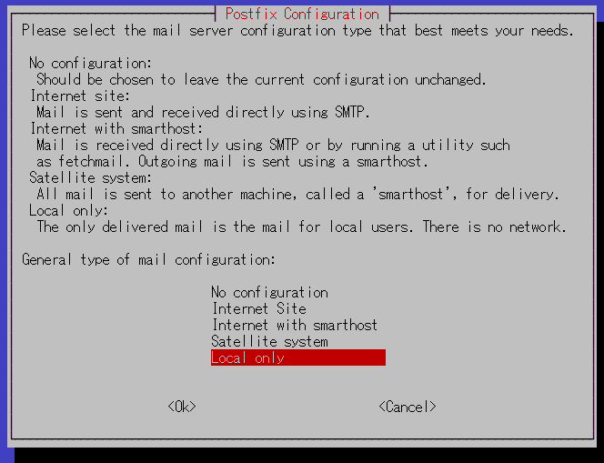
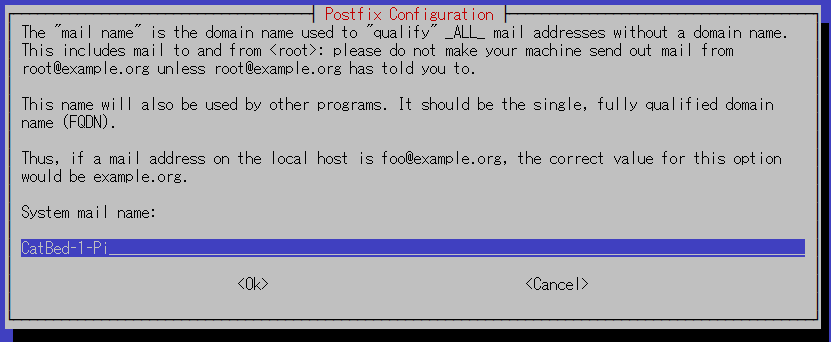
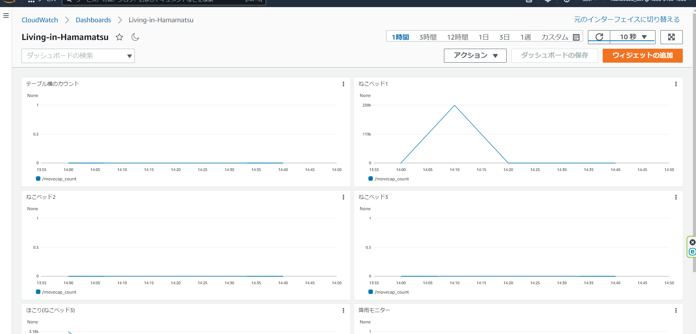
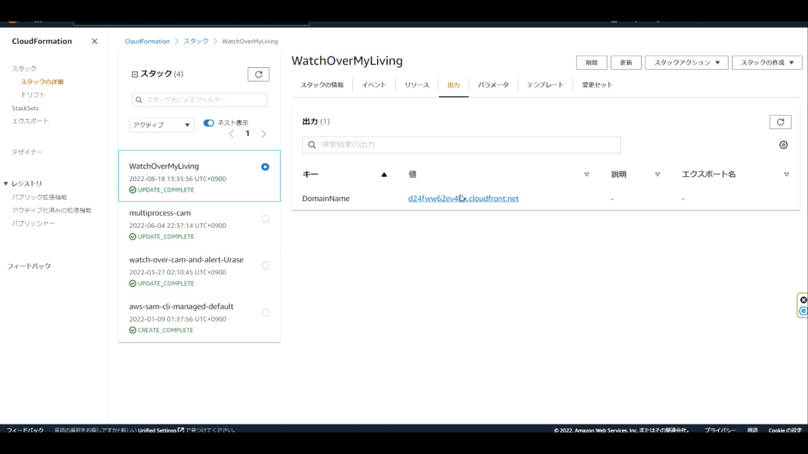
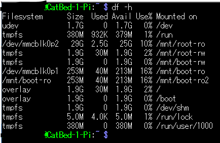
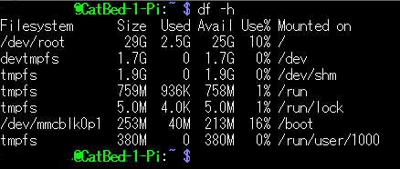

# **Monitoring-system-with-Raspberry-Pi-and-AWS**
You can watch the sensor count detected by the Raspberry Pi and a 15-second video before and after the sensor reacts on the web page.  

<br>

## **What can be done**
This is a repository that allows you to do the following to build a remote monitoring system using sensor monitors and event images.  

1. Prepare the location you want to watch as a parameter name and create a configuration file interactively.  
2. Using the parameters of the input configuration file, implement the sensor and camera program to operate on the Raspberry Pi installed in the first location with a shell script.  
3. Deploy AWS resources with sam cli from the Raspberry Pi command line installed in the first location using the parameters in the configuration file you entered.  
4. Using the parameter name of the input configuration file, implement the sensor and camera program to operate on the Raspberry Pi installed in the second and subsequent locations with a shell script.  
<br>
<br>


# **Specifications**  
## **Architecture**
<br />

<br />
<br />

## **Event recording work flow**
<br />

<br />
<br />

## **Physical specifications**
### **Sensor**

For detection of objects such as people：  
* HC-SR501 Passive Infrared Motion Sensor  (datasheet: ./pdf/HC-SR501.pdf)  
* E18-D80NK Infrared Distance Sensor  (datasheet: ./pdf/e18-d80nk.pdf)  
HC-SR501 is normal close and E18-D80NK is normal open.  
<br>

### **webCAM**

For recording objects such as people：  
* USB 2.0 compatible (e.g., C270N HD web cam)  
<br>

#### **RaspberryPi**
Hardware: BCM2711  
Model: Raspberry Pi 4 Model B Rev 1.2  
microSD card: 32GB or more
<br>
<br />

## **Development environment**
<br>

#### **RaspberryPi**
Kernel: Linux    
Kernel release: raspberrypi 5.15.56-v8+  
Kernel version: #1575 SMP PREEMPT aarch64(Recommend to use 64bits OS distrubution)  
OS： Raspbian GNU/Linux 11 (bullseye)  
Language: python 3.9.2
<br>
<br>

# **Construction procedure**

## **Preparation**
1.  Prepare RaspberryPi OS image disc using Raspberry Pi imager.  
  (Raspberry Pi OS (other) > Raspberry Pi OS Lite (64-bit) recommended).  
  https://www.raspberrypi.com/software/  
2.  Prepare an AWS account.  
3.  Prepare IAM user with 8 custom managed policies of ./user_policy, AWSIoTFullAccess and IAMReadOnlyAccess attached, or IAM user with administrator authority attached (not recommended) so that both console login and access key can be used.  You must replace "{your accountID}" to your accountID in 2 custom policies.  
4. Download access key ID and secret access key.  
5. Deploy CloudFormation Stack of Count Macro published on awslabs with reference to [this article](https://qiita.com/dnpds-murata/items/5c9e507bce2b6dbf695d).
6. Insert the OS image disc into the Raspberry Pi and turn on the power.
7. Make initial settings for Raspberry Pi and connect to the Internet.
<br>
<br>

## **Decide the parameters and design the project**
Decide up to 6 parameters as shown in the figure.  Up to 4 locations can be set.  
  
1. Name your watch project.  
2. Decide the number of cameras and Raspberry Pi to install.  
3. Name the location where the camera and Raspberry Pi will be installed.  
4. Decide the S3 bucket name for uploading videos recorded by the camera.  
5. Prepare images for the web page that will view the uploaded video.
<br>

<br />
<br>

## **Building the 1st Raspberry Pi and deploying AWS Resources**
Git clone this repository to the Raspberry Pi for Place1 to build a Raspberry Pi environment and deploy AWS resources from the Raspberry Pi with SAM CLI.  
  
Before clone this repository, install python3-dev, python3-pip and git for Raspberry Pi.
```sh
sudo apt install -y python3-dev python3-pip git
python3 -m pip install --upgrade pip
```
  
Clone this project from public repository
```sh  
git clone https://github.com/nsaito9628/Monitoring-system-with-Raspberry-Pi-and-AWS.git
```  

Replace the sample image prepared in /template/img of the repository with the image prepared for your web page.  
 
<br />
  
<br />

Set parameters to config and template.yaml  
Palameter names Member must satisfy regular expression pattern: ^[a-zA-Z0-9_]+$.
```sh
cd ./Monitoring-system-with-Raspberry-Pi-and-AWS
python set_parameters.py  
```
Enter 1 for the first question on the Raspberry Pi for Place1, e.g., 1st parameter of 4 RaspberryPi used as below.  

>What number is this place to set RaspberryPi and cam (Allowed values are 1, 2, 3 or 4): 1  
>Input project name e.g., room name such as 'MyLiving': MyLiving  
>Input number of places you need to watch over (less than 4): 4  
>Input for Place No.1  
>Input place name: CatBed1  
>Input sensor type if normal close is '0' else normal open is '1': 1  
>Input for Place No.2  
>Input place name: CatBed2  
>Input sensor type if normal close is '0' else normal open is '1': 1  
>Input for Place No.3  
>Input place name: CatBed3  
>Input sensor type if normal close is '0' else normal open is '1': 0  
>Input for Place No.4  
>Input place name: CatBed4  
>Input sensor type if normal close is '0' else normal open is '1': 1  
>Input trigger type if to use sensor is '0' else motion detection is '1': 1  
>Input S3 bucket name to upload mp4 files: neko-mimamori  
>Input your AWS account Id : ${your AWS account id}

Deploy edge project to Raspberry Pi  
``` sh
cd ..
cp -r ./Monitoring-system-with-Raspberry-Pi-and-AWS/src/* ~
```

Download and unpack the required packages
```sh
sudo chmod u+x environment.sh
./environment.sh
```
Postfix config chooses local setting and using the default email address.
<br />
  

<br>
<br>

Set AWS configuration as default profile  
```sh
aws configure
```  
>(Replace with your own key)  
AWS Access Key ID[]: your Access Key ID  
AWS Secret Access Key []: your Secret Access Key  
Default region name []: ap-northeast-1  
Default output format []:  

<br>
  
Registration of RaspberryPi as a thing to AWS IoT core and automatic startup setting
```sh
cd cert
sudo chmod u+x iot_prov.sh
./iot_prov.sh
```

<br>

Deploy CloudFormation stack  
Change stack-name to your Project name 
```sh
cd ../Monitoring-system-with-Raspberry-Pi-and-AWS/template
sam build
sam deploy --guided --capabilities CAPABILITY_NAMED_IAM --stack-name MyLiving
```
>Setting default arguments for 'sam deploy'
        =========================================  
        Stack Name [my-mimamori-stack]: MyLiving  
        AWS Region [ap-northeast-1]:  
        Parameter ProjectName [MyLiving]:   
        Parameter Place1 [CatBed1]:  
        Parameter Place2 [CatBed2]:  
        Parameter Place3 [CatBed3]:  
        Parameter Place4 [CatBed4]:   
        Parameter OrgBucketName [neko-mimamori]:   
        Parameter NameTag [MyLiving]:   
        Parameter EventPrefix [emr]:  
        #Shows you resources changes to be deployed and require a 'Y' to initiate deploy
        Confirm changes before deploy [Y/n]: Y  
        #SAM needs permission to be able to create roles to connect to the resources in your template Allow SAM CLI IAM role creation [Y/n]: Y  
        #Preserves the state of previously provisioned resources when an operation fails
        Disable rollback [Y/n]: Y  
        Save arguments to configuration file [Y/n]: Y  
        SAM configuration file [samconfig.toml]:  
        SAM configuration environment [default]:   
        ・  
        ・  
        ・  
        Deploy this changeset? [y/N]: y  

Confirm message like "Successfully created/updated stack - any-stack-name in ap-northeast-1"  
<br>
Deploy web page project on S3 
```sh
sudo chmod u+x mimamori-project-deploy.sh
./mimamori-project-deploy.sh
```

Open a web page with CloudFront URL
<br />

<br />
<br />

Place the camera in place and restart the Raspberry Pi.  
```sh
sudo reboot
```
<br>

## **Building the environment for the second and subsequent Raspberry Pi**
Git clone this repository to the Raspberry Pi for Place2 or later place numbers to build a Raspberry Pi environment.  

Before clone this repository, install python3-dev, python3-pip and git for Raspberry Pi.
```sh
sudo apt install -y python3-dev python3-pip git
python3 -m pip install --upgrade pip
```
  
Clone this project from public repository
```sh  
git clone https://github.com/nsaito9628/Monitoring-system-with-Raspberry-Pi-and-AWS.git
```

Set parameters to config and template.yaml  
```sh
cd ./Monitoring-system-with-Raspberry-Pi-and-AWS
python set_parameters.py  
```
Enter 2 to 4 for the first question on the Raspberry Pi for Place2 to Place4, e.g., 4th parameter of 4 RaspberryPi used as below.  .

```sh
python set_parameters.py
```
>What number is this place to set RaspberryPi and cam (Allowed values are 1, 2, 3 or 4): 4  
>Input for Place No.4  
>Input place name: CatBed4  
>Input sensor type if normal close is '0' else normal open is '1': 1  
>Input trigger type if to use sensor is '0' else motion detection is '1': 1  
>Input S3 bucket name to upload mp4 files: neko-mimamori  
>Input your AWS account Id : ${your AWS account id}  

Deploy edge project to Raspberry Pi  
``` sh
cd ..
cp -r ./Monitoring-system-with-Raspberry-Pi-and-AWS/src/* ~
```

Download and unpack the required packages
```sh
sudo chmod u+x environment.sh
./environment.sh
```
Postfix config chooses local setting and using the default email address.
<br />
  

<br />
<br>

Set AWS configuration as default profile  
```sh
aws configure
```  
>(Replace with your own key)  
AWS Access Key ID[]: your Access Key ID  
AWS Secret Access Key []: your Secret Access Key  
Default region name []: ap-northeast-1  
Default output format []:  

  
Registration of RaspberryPi as a thing to AWS IoT core and automatic startup setting
```sh
cd cert
sudo chmod u+x iot_prov.sh
./iot_prov.sh
```

Place the camera in place and restart the Raspberry Pi.  
```sh
sudo reboot
```
<br>

## **Confirmation of operation** ##

From the IAM user's management console, go to CloudWatch> Dashboards> WatchOver Dashboard (Your Dashboard) and see the signal from the Raspberry Pi.  

<br >
  
<br >
<br >

Put the upload trigger on the motion detection of the sensor or camera, open the viewing page of the Cloudfront domain and check the uploaded mp4 file.  

<br >
  
<br />
<br />

## **Protection of microSD card** ##  

Stop swapping and set to write to RAM during continuous use so that the file system will not be damaged by loads such as repeated writes or power outages.  

Change user to root.
```sh
cd ..
sudo su
```  
Stop the swapfile.  
```sh
apt-get install git subversion rsync gawk busybox bindfs
echo Disabling swap
dphys-swapfile swapoff
dphys-swapfile uninstall
update-rc.d dphys-swapfile disable
systemctl disable dphys-swapfile
```
Clone root-ro.git.  
```sh
git clone https://github.com/josepsanzcamp/root-ro.git
```
Set the boot configuration and reboot.    
```sh
rsync -va root-ro/etc/initramfs-tools/* /etc/initramfs-tools/
mkinitramfs -o /boot/initrd.gz
echo initramfs initrd.gz >> /boot/config.txt
reboot
```  
<br >  

Check mmcblk0p2 mounted on /mnt/root-ro.   

  
<br />

After confirming that it is mounted, remove the protection once.  

```sh
sudo mount -o remount,rw /dev/mmcblk0p1
sudo grep -v initramfs /mnt/boot-ro/config.txt >/tmp/config.txt
sudo cp /tmp/config.txt /mnt/boot-ro/config.txt
sudo reboot
```
<br >  

Check mmcblk0p2 mounted on /mnt/root-ro.   

  
<br />

Install the script for re-executing this protect and unprotecting.  

```sh
cd ..  
sudo cp ./Monitoring-system-with-Raspberry-Pi-and-AWS/protect/protect /bin/  
sudo cp ./Monitoring-system-with-Raspberry-Pi-and-AWS/protect/nonprotect /bin/  
cd /bin  
sudo chmod u+x protect  
sudo chmod u+x nonprotect  
```  


Protect the microSD card and reboot
```sh
sudo protect
```


